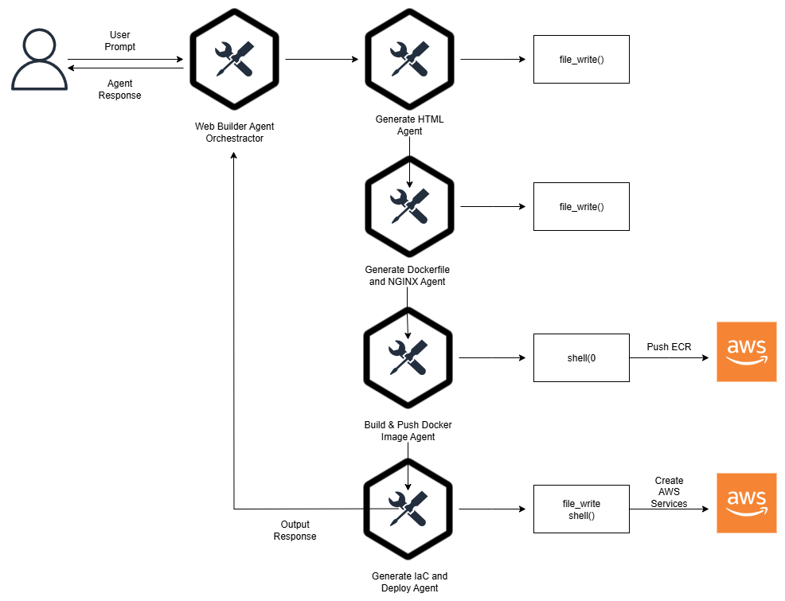

# SPA Web Builder Agent

This project uses the **AWS Strands Agent** to orchestrate an AI-powered workflow for generating and deploying a Single Page Application (SPA) website. The agent automates the entire process:

1. **Generate HTML**  
2. **Generate Dockerfile & Nginx configuration**  
3. **Build and push Docker image to AWS ECR**  
4. **Generate Terraform configuration**  
5. **Deploy the application to AWS ECS**

`This application did not work on Windows`

---
## 🧩 Workflow Overview


---

##  Prerequisites

Before you run this project, make sure you have installed and configured the following:

- **Python** `3.10.18`
- **[uv](https://github.com/astral-sh/uv)** Python package manager
- **Docker**
- **Terraform**
- **AWS CLI** configured with:
  - **AWS Access Key ID**
  - **AWS Secret Access Key**
  - Bedrock Model
  - IAM user permissions to:
    - Create and push ECR repositories
    - Provision ECS resources
    - Create VPC, Load Balancer, IAM Roles, and other infrastructure

##  Getting Started

1. **Clone the repository**
   ```bash
   git clone https://github.com/fromhell13/spa-web-builder-agent.git
   cd spa-web-builder-agent
   ```

2. **Install dependencies**
    ```bash
    uv sync
    ```

3. **Configure AWS credentials**

    You can export them in your shell or configure them using `aws configure`:
    ```bash
    export AWS_ACCESS_KEY_ID=your-access-key
    export AWS_SECRET_ACCESS_KEY=your-secret-key
    export AWS_DEFAULT_REGION=your-region
    ```
    > [!TIP]
    > If you want to bypass tool consent, you can run `export BYPASS_TOOL_CONSENT=true`

4. **Run the Agent Workflow**
    ```bash
    uv run main.py
    ```

## Notes
- Docker: Ensure Docker is running locally to build and push images.
- IAM Permissions: You need full permissions for ECS, ECR, IAM, VPC, and related services.
- Region: Confirm your AWS region matches your ECR and ECS configuration.

> [!WARNING]
> Run `terraform destroy` to avoid AWS cost in your AWS account

